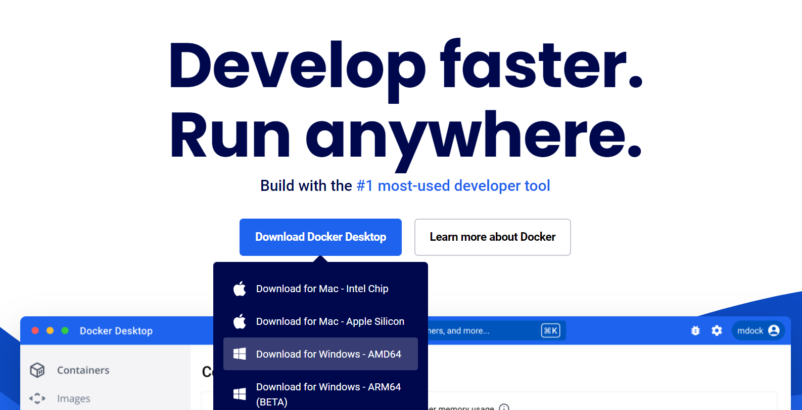
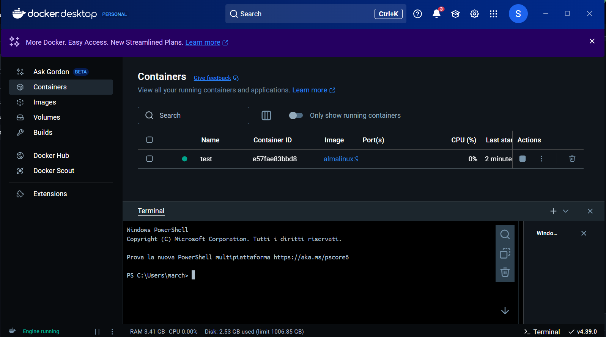

# Installing Docker on Windows & Running an AlmaLinux 9 Container
------------------------------------------

## Introduction
Docker is a powerfull tool that makes it easy to create lightweight, portable, and self-sufficient containers that run your applications or even entire operating systems. This guide will walk you through the process of installing Docker on a Windows machine and running an AlmaLinux 9 container.

>[!NOTE]
>This guide doesn't replace the [official one](https://docs.docker.com/desktop/setup/install/windows-install/). It's just shorter.

## Before installing
Windows Subsistem for Linux 2 (WSL2) is a feature of Windows that allows you to run a Linux environment on your Windows machine without the need to use a virtual machine. 

1. Install or update WSL
   ```powershell
   wsl --install
   ```
   ```powershell
   wsl --update
   ```  
2. Be sure that the active version is 2
   ```powershell
   wsl.exe --set-default-version 2
   ```
3. Restart the pc
   
## Install Docker
1 Download Docker Desktop
  - Go to the [Docker Desktop page](https://www.docker.com)
  - Click Download for Windows 

2. Install Docker
  - Run the installer
  - Follow the installer prompts
  - Be sure to select “Use WSL 2 instead of Hyper-V”
  - Restart the pc

3. Start Docker
   - Verify the Docker version from Windows powershell
    ```powershell
    docker --version
    ```
    Should be something like
    ```powershell
    Docker version 28.x.x, build xxxxxx
    ```
  - Launch docker
  - Accept the license agreement
    
## Run AlmaLinux 9 container
1. Install AlmaLinux
   - Open the terminal on Docker 
   - Install AlmaLinux 9
     ```powershell
     docker pull almalinux:9
     ```
2. Create an Almalinux container
   - To create a container called <container_name> write on the terminal
     ```powershell
     docker run -it --name <container_name> almalinux:9 /bash
     ```
   - For starting a container
     ```powershell
     start -i <container_name>
     ```
   - For closing the container
     ```powershell
     exit
     ```

## Conclusion
Congratulation now you have a working AlmaLinux envairoment in Windows.
